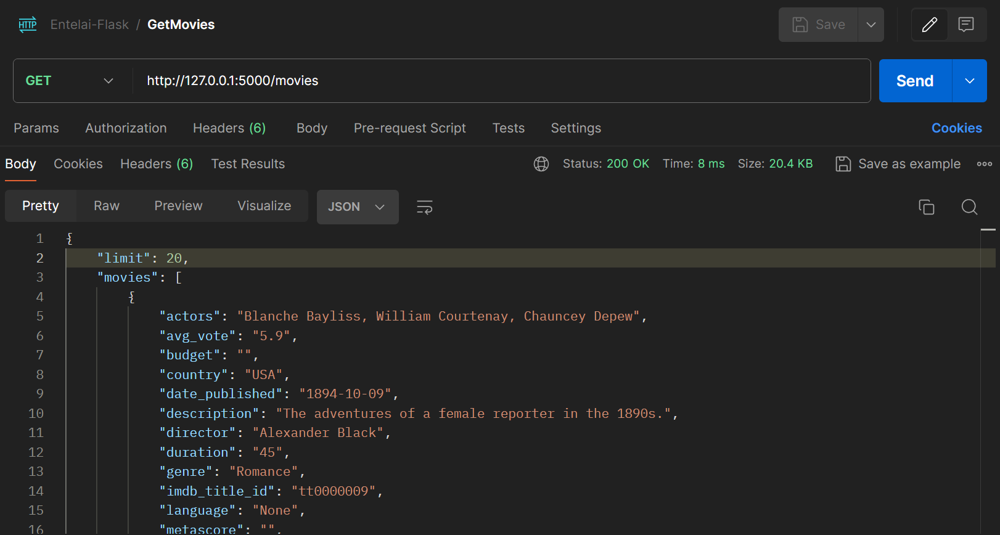
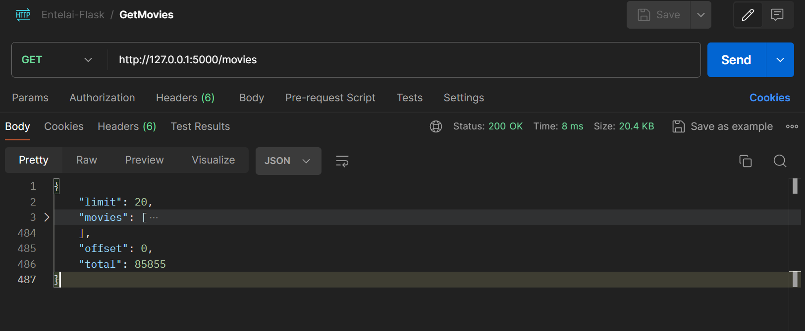
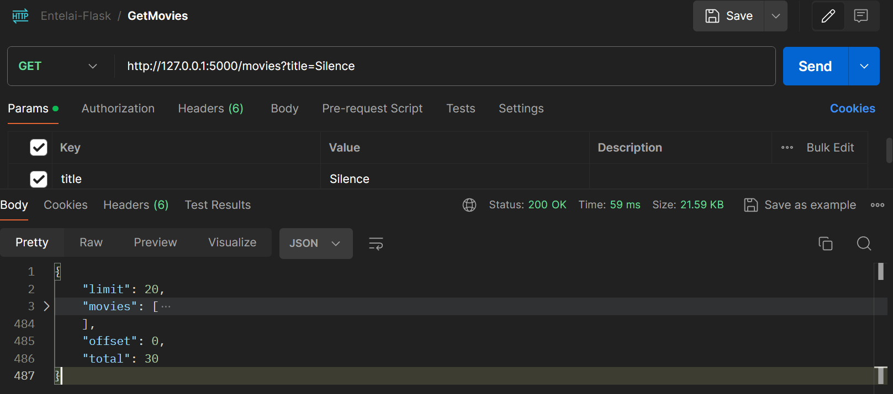
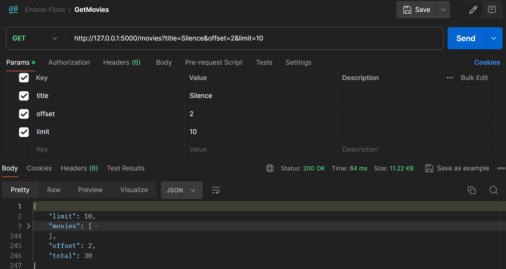
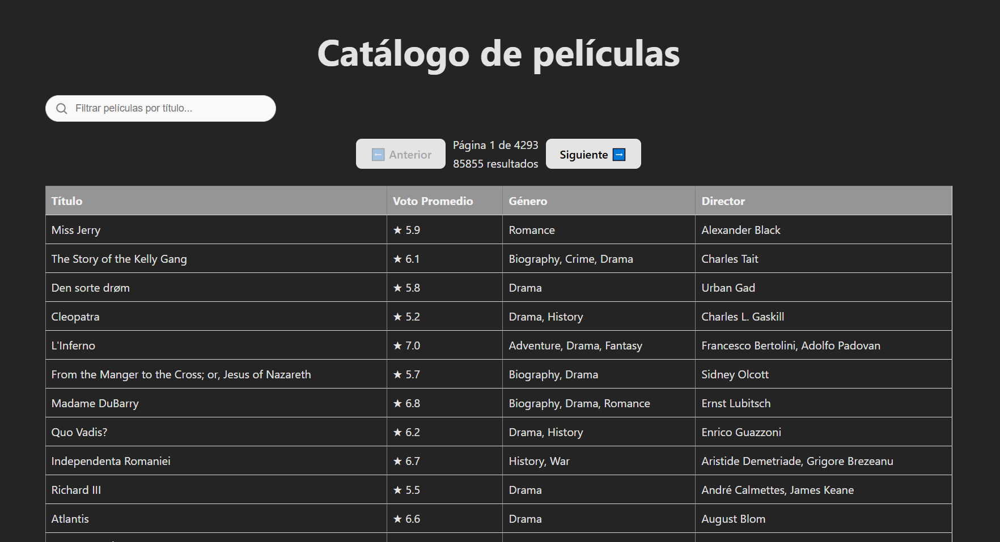
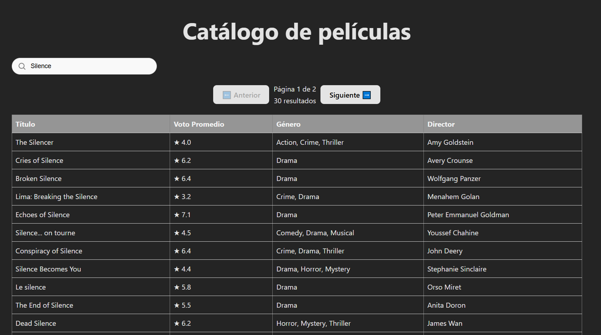
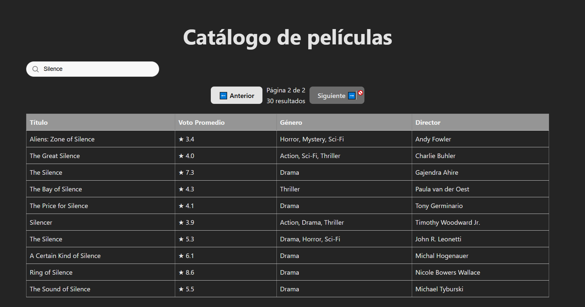
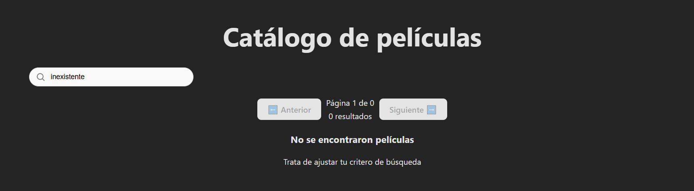

# Desafío Técnico: Visualizador de Películas IMDB

## Descripción del Proyecto
El objetivo de este desafío es construir una aplicación fullstack que cargue un archivo CSV con una lista de películas de IMDB y exponga esta información a través de una API en Flask. Además, se debe desarrollar un frontend en React que permita visualizar y filtrar las películas por título.

## Backend - Flask
Se implementó una API REST con Flask que maneja la información de películas.

### **Endpoints**
- **GET /movies**
    - Endpoint principal del proyecto. Retorna una lista de películas almacenadas en el backend.
    - **Query Params:**
        - `title`: Permite filtrar las películas por título.
        - `limit`: Define la cantidad de películas devueltas por la consulta. Por defecto, si no se proporciona un valor, se devuelven hasta 20 películas para mejorar el rendimiento y la experiencia del usuario.
        - `offset`: Define el desplazamiento de los resultados. Por ejemplo, si existen 40 películas y se establece un `limit=20`, se devolverán las primeras 20. Si además se pasa un `offset=20`, la consulta devolverá las siguientes 20 películas.

### **Testing**
Se implementaron pruebas unitarias para garantizar el correcto funcionamiento de la API REST. Se validaron los siguientes casos:

1. **test_get_all_movies:** Verifica que la API devuelve correctamente todas las películas con los campos esperados, aplicando el límite por defecto de 20.
2. **test_movie_search_by_title:** Comprueba que la búsqueda por título funciona y que los resultados contienen el texto buscado.
3. **test_pagination:** Valida que la paginación funcione correctamente y que los resultados cambien según el offset.
4. **test_limit_parameter:** Asegura que el parámetro limit controla la cantidad de películas devueltas.

## Frontend - React
Para la implementación del frontend se utilizó React junto a [Vite](https://vite.dev/) como principal herramienta de build. Se optó por utilizar CSS nativo para los estilos.

### **Estructura del Proyecto**
La organización de carpetas en el frontend sigue una estructura modular:

```
frontend/
│── src/
│   ├── components/     # Componentes reutilizables
│   │   ├── MovieList.jsx
│   │   ├── Pagination.jsx
│   │   ├── SearchBar.jsx
│   ├── App.jsx         # Componente principal
│   ├── main.jsx        # Punto de entrada
│── public/             # Archivos estáticos
│── package.json        # Dependencias y scripts
```

### **Componentes**
- **`MovieList.jsx`**: Se encarga de mostrar la lista de películas en formato de tabla, obteniendo los datos desde la API.
- **`Pagination.jsx`**: Implementa la funcionalidad de paginación, permitiendo al usuario navegar entre páginas.
- **`SearchBar.jsx`**: Permite al usuario buscar películas por título en la API y actualizar la vista con los resultados obtenidos.

## Ejecución
Antes de ejecutar el sistema, se debe asegurar que el backend tenga un directorio con nombre `data` y el archivo CSV con las películas. Se asume que este archivo ya ha sido proporcionado.

```bash
backend/data/movies.csv
```

### **Paso 1 - Configuración y Ejecución del Backend**
1. Crear un entorno virtual en Python, activarlo e instalar las dependencias:

```bash
python3 -m venv env
source ./env/bin/activate  # En Windows: env\Scripts\activate
pip install -r requirements.txt
```

2. Ejecutar el servidor Flask:

```bash
python3 app.py
```

El backend quedará ejecutándose en la terminal y estará disponible en `http://localhost:8000`.

### **Paso 2 - Configuración y Ejecución del Frontend**
1. Instalar las dependencias de React:

```bash
npm install
```

2. Iniciar el servidor de desarrollo:

```bash
npm run dev
```

El frontend estará disponible en `http://localhost:5173` (por defecto en Vite).


### Ejecución pruebas

Considerando que ya se encuentra en el entorno virtual de python con los requirements instalados, se deberá ejecutar en la carpeta de backend:


```bash
python test_app.py
```

## Ejemplos

### Pedido de query - Básica
- Se observa que, utilizando Postman y realizando una query GET http://127.0.0.1:5000 (con el backend prendido en segundo plano) devuelve un json con diferentes datos:
    - limit: Límite que se está utilizando para enviar las películas
    - movies: Listado de películas (en este caso, 20, dado el limit).
    - offset: Desplazamimento de los resultados.
    - total: Cantidad total de películas que cumplen con la condición.





### Pedido de query - con filtro de title
En este caso, se aplicó una queryParam y modificó los resultados, con un total de 30 ocurrencias.



### Pedido de query - modificando offset y limit
En este caso, el backend sigue respondiendo que existen 30 ocurrencias, pero en este caso se modificó el offset y el límite de películas recibidas.




## Muestras de frontend







